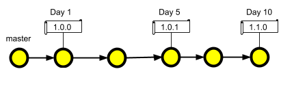
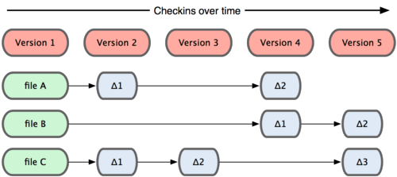
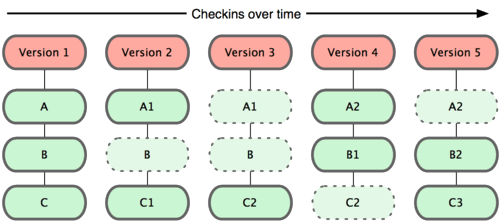
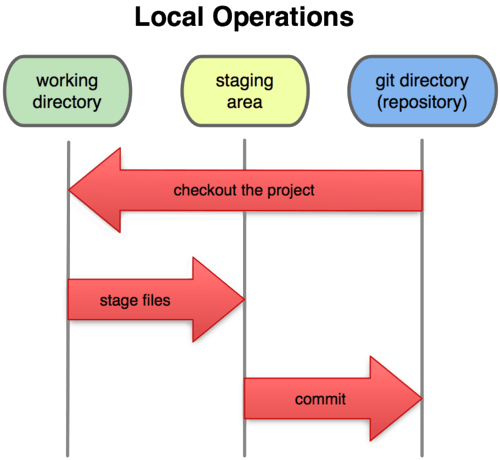
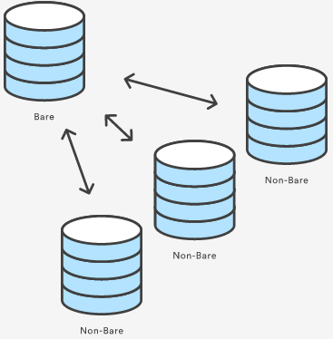
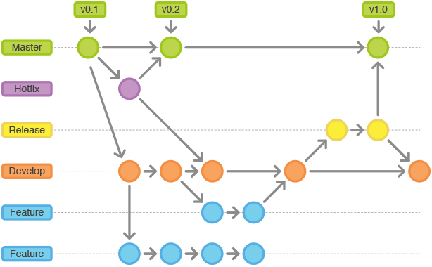

# GIT da Massa!

Documento destinado aos estudos sobre o melhor e mais zica até o momento dos versionadores!! [:smile]

- [GIT da Massa!](#git-da-massa)
  - [Versionamento de Código com GIT](#versionamento-de-código-com-git)
    - [Versionadores](#versionadores)
    - [O que é o GIT ?](#o-que-é-o-git-)
    - [Outros VCS's](#outros-vcss)
    - [Entendendo o GIT](#entendendo-o-git)
    - [Instalação do GIT](#instalação-do-git)
    - [Iniciando um repositório.](#iniciando-um-repositório)
    - [Os Estados do Git](#os-estados-do-git)
    - [LOGS GIT](#logs-git)
    - [Ignorando arquivos no versionamento](#ignorando-arquivos-no-versionamento)
  - [Repositorio Remoto](#repositorio-remoto)
  - [Enviando arquivos de um repositório remoto](#enviando-arquivos-de-um-repositório-remoto)
  - [Recebendo arquivos de um repositório remoto](#recebendo-arquivos-de-um-repositório-remoto)
    - [Branches](#branches)
    - [Criando, Listando e Trocando de Branches](#criando-listando-e-trocando-de-branches)
    - [Merge e Rebase](#merge-e-rebase)
    - [Ctrl + Z no Git](#ctrl--z-no-git)
    - [Guardando para depois](#guardando-para-depois)
    - ["Viajar no tempo" no projeto](#viajar-no-tempo-no-projeto)
    - [Acompanhando as diferenças](#acompanhando-as-diferenças)
    - [Realizando nossas releases](#realizando-nossas-releases)
    - [Exibidos os responsáveis](#exibidos-os-responsáveis)
    - [Cherry-pick](#cherry-pick)


## Versionamento de Código com GIT

Versionamento de código é o processo de se criar versões de códigos de acordo com uma linha do tempo para o andamento dos desenvolvimento de melhorias, correções ou novas funcionalidades.





### Versionadores

Para o versionamento de código são utilizados sistemas chamados de VCS (Version Control System) ou SCM (Source Code Management), que são softwares que têm a finalidade de gerenciar as diferentes versões no desenvolvimento de um código. Alguns exemplos de softwares de controle de versão Open-Source são:
  -   CVS
  -   Mercurial
  -   GIT
  -   SVN


### O que é o GIT ?


O GIT é um VCS amplamente utilizado nos dias de hoje para o processo de desenvolvimento de software e versionamento de documentos. Foi projetado e desenvolvido por Linus Torvalds para o desenvolvimento do kernel Linux e se tornou a maior ferramenta OpenSource de versionamento do mercado.

O GIT trabalha com dados como se fossem grupos de snapshots de um pequeno sistema de arquivo.


### Outros VCS's

Outros sistemas constumam armazenar dados, como mudanças em uma versão inicial de cada arquivo.



A maior diferença entre o GIT e qualquer outro VCS (Subversion e similares inclusos) está na forma que o GIT trata os dados. Conceitualmente a maior parte dos outros sistemas armazena informação como uma lista de mudanças por arquivo. Esses sistemas tratam a informação que mantém como um conjunto de arquivos e as mudanças feitas a cada arquivo ao longo do tempo.

### Entendendo o GIT



Toda vez que um usuário realiza um commit ou salva o estado atual do projeto, o GIT tira uma imagem do estado de todos os arquivos e grava uma referência do estado (snapshot). Se o arquivo não possui nenhuma alteração, o GIT não grava os arquivos novamente, ele simplesmente cria um link para o arquivo anterior. O GIT pensa como se os arquivos e suas alterações fossem um fluxo de snapshots.


### Instalação do GIT

[Download GIT](https://git-scm.com/downloads)

Para garantirmos a instalação, podemos executar:  
> git --version


### Iniciando um repositório.

Crie um novo diretório e acesse o mesmo.

> mkdir projeto
> cd projeto

Qualquer repositório pode se tornar um repositório do GIT, para isto basta executar o comando git init.

Inicie o repositório

> git init

Ao digitar esse comando, será criado um diretório oculto chamado .git no diretório atual. Esse diretório é a base de dados do GIT, e constitui o repositório em si. Nele serão guardadas as informações de commits, tags e branches, ou seja, todas as informações referentes ao repositório.

Os comandos que aprenderemos o git irão manipular o conteúdo desta pasta, por isso não precisamos mexer diretamente nela.

Algumas informações acompanharão esse processo, tais como: e-mail, nome, data, hora e mensagem de identificação. Algumas destas informações são geradas automaticamente, outras deveos informar.

**ESCOPO**

    - local: para um projeto específico;
    - global: para todos os projetos.

Configure o nome do proprietário;
Configure o e-mail do proprietário;

```
git config --**escopo** user.name "Seu Nome"
git config --**escopo** user.email "seuemail@seudominio.com.br"
```

Com o comando git config, salvamos os dados em variáveis de configuração do GIT, ao enviar os dados para um servidor estas informações também serão enviadas.
para visualiar as configurações:
```
git config user.email
git config user.name
```
É possível listar todas as configurações do GIT configuradas através do comando:
```
git config --list
```

### Os Estados do Git

Diretório de Trabalho, área de preparação e o diretório do GIT.



Essa é uma parte das mais importantes para entender o funcionamento do GIT. O GIT faz com que seus arquivos sempre esteja em um dos três estados fundamentais:

- Consolidado (Commited) -> Dados são ditos consolidados quando estão seguramente armazenados em sua base de dados local;
- Modificado (Modified) -> Trata-se de um arquivo que sofreu mudanças mas que ainda não foram consolidados na base de dados;
- Preparado (Staged) -> Um arquivo é tido como preparado quando você marca um arquivo modificado em sua versão corrente para qeu ele faça parte do snapshot do  próximo commit.

Isso nos traz para as três seções do GIT:

- Diretório do GIT (Git Directory, Repository) -> Local onde o GIT armazena os metadados e o banco de objetos de seu projeto. É a parte copiada quando você clona um repositório.
- Diretório de Trabalho (Working Directory) -> É um unico checkout de uma versão do projeto. Estes arquivos são obtidos a partir da base de dados comprimida no diretório do GIT e colocados em disco para que você utilize ou modifique.
- Área de Preparação (Staging area) -> É um simples arquivo contido em seu diretório GIT que armazena informações sobre o que irá em seu próximo commit. É bastante conhecido como índice(index), mas está se tornando padrão chamá-lo de área de preparação

O workflow básico do GIT pode ser descrito assim:

1. Você modifica arquivos no seu diretório de trabalho;
2. Você seleciona os arquivos, adicionando snapshots deles a sua área de preparação;
3. Você faz um commit, que leva os arquivos como eles estão na sua área de preparação e os armazena permanentemente no seu diretório GIT.


**Agora que temos nossas informações já configuradas, vamos iniciar o versionamento do diretório.**

Dentro do diretorio do projeto crie o seguinte arquivo html, "index.html".

```
<!DOCTYPE html>
<html lang="en">
<head>
    <meta charset="UTF-8">
    <title>Lista de Cursos</title>
</head>
<body>
    <ul>
        <li>Vagrant</li>
        <li>Docker</li>
        <li>Ansible</li>
        <li>Integração Contínua</li>
        <li>Kubernetes</li>
    </ul>
</body>
</html>

```


Execute o comando **git status** para garantir que você está em um repositório Git e que o arquivo _index.html_ é reconhecido.

> git status

Ao ser rodado, neste caso, por exemplo, ele nos informa que está sendo rodado no ramo, ou branch master (On branch master), e que não possui nenhum commit (No commits yet).

O comando git add adiciona o arquivo em uma área chamada staging.


> git add [parametros]

**Parametros** :
```
-A
--all 
.
nome do arquivo
coringas: "*.txt, arquivo\*, dir/*"
```


O commit, basicamente é a captura instantânia das mudanças realizadas no projeto. 
Após confirmado podemos considerar como uma versão "segura" aonde não se altera a menos que seja solicitado de forma explicita a alteração.
Antes da execução do git commit, o comando git add é usado para promover ou 'estágio' alterações no projeto que serão armazenadas em um commit.

> git commit -m "Criando arquivo index.html com lista de tópicos"


__"As boas práticas pede para colocarmos mensagens descritivas, evitando que fiquem muito grandes".__

**Parametros:**
```
-m: usado para passar uma mensagem ao commit que será realizado.
-a: realiza a captura instantânia de todas as alterações no diretorio de trabalho, dos arquivos rastreados.
```

**Curiosidades**
Ao executar o comando git status, recebemos algumas informações que talvez não estejam tão claras, principalmente quando nos deparamos com termos como HEAD, working tree, index,etc.
Apenas para esclarecer um pouco, visto que entenderemos melhor o funcionamento do Git durante o treinamento, seguem algumas definições interessantes:

    * HEAD: Estado atual do nosso código, ou seja, onde o Git nos colocou;
    * Working tree: Local onde os arquivos realmente estão sendo armazenados e editados;
    * index: Local onde o Git armazena o que será commitado, ou seja, o local entre a working tree e o repositório Git em si.


### LOGS GIT

> git log

Nos mostrará diversas informações, sendo o primeiro deles um hash do commit, uma identificação única de cada commit, isto é, não existem dois commits com o mesmo hash. A informação seguinte se refere ao branch, ou "ramo" em que o commit se encontra. Neste caso, verificamos que há HEAD e master. Isto quer dizer que HEAD é o local onde nos encontramos, no nosso código, onde acontecem as alterações que fizermos, e que estamos em um ramo denominado master.

**Modelos de logs:**

- uma única linha:
> git log --oneline

- E em vez de menos informações quisermos mais:
> git log -p

- Existe uma infinidade de formatos que podemos usar como filtros para mostrar nosso histórico em: [cheatsheet](https://devhints.io/git-log)

- Comando que nos traz apenas o hash:
> git log --pretty="format:%H"  

- Traz o hash resumido seguido pela mensagem do commit.
> git log --pretty="format:%h %s"

- Mostra as linhas de alteração.
> git log --graph


### Ignorando arquivos no versionamento

**Porquê ignorar arquivos?**

Normalmente no processo de desnevolvimento de software existem alguns arquivos que não gostariamos que fossem versionados como por exemplo, arquivos compilados, arquivos com senha ou arquivos temporários que são criados por editores.

**.gitginore**

Com o GIT o controle destes arquivos fica muito mais fácil, podemos criar um arquivo chamado .gitignore e passar algumas opções e assim conseguiremos dizer quais arquivos por projeto ou usuário não devem ser publicados.
A maneira mais simples e fácil de gerenciar as exclusões é criar um arquivo .gitignore no diretório raiz do projeto.
Os arquivos que escolheremos para ignorar serão ignorados em todos os diretórios do projeto.

**ATENÇÃO:** É importante lembrar que o arquivo é um arquivo oculto, por isto seu nome começa com o caractere ponto ( . )

O Arquivo .gitignore consegue compreender alguns tipos de declarações, tais como:

```
Arquivos específicos -> arquivo1.txt
Curingas -> *.txt
Diretórios -> /files/keys/
Expressões Regulares (Regex) -> arquivo{1…5}.txt
```

Sintaxe do arquivo gitignore:

```
“!”— Deve ser utilizado para negar um padrão, tornando-o valido novamente. Não valendo para diretórios.

“foo/” — Caso o padrão termine em “/” o git irá considerar somente o diretório foo.

“foo” — Nesse caso será tratado como um padrão a ser verificado no level mais alto do diretório onde o .gitignore se encontra.

“**/” — Casa qualquer diretório. Por exemplo: se especificado **/foo será válido para foo/ e **/foo/bar, sendo válido para qualquer diretório “bar” antecedido por “foo”.

“/**” — Casa todo o conteúdo dentro do diretório.

“a/**/b” — Casa qualquer conteúdo entre os diretório existentes entre a e b.
```

**Utilizando o .gitignore**

Crie o arquivo .gitignore com o conteúdo config.conf

> echo "config.conf" > .gitignore

Neste exemplo, qualquer arquivo com o nome de config.conf em qualquer diretório será ignorado no commit
Adicione o arquivo ao repositório e efetue o commit:

```
git add .gitignore
git commit -m "Adicionado gitignore"
```

## Repositorio Remoto


criar um diretorio:
> mkdir servidor

acessar o diretorio:
> cd servidor

Como este servidor será um repositório do Git que somente armazenará as alterações, ou seja, não o acessaremos para editar arquivos, por exemplo, usaremos **git init --bare**, cujo parâmetro indica que este repositório é puro, que contém apenas as alterações dos arquivos, e não uma cópia física de cada um dos arquivos.

> git init --bare

você está criando um repositório que é pushable. Geralmente os repositórios bare são criados no servidor e são considerados repositórios para armazenamento, em contraste aos repositórios que vão nas máquinas dos desenvolvedores que seriam os repositórios de desenvolvimento, criados com o comando git init (sem o --bare).




> git remote

Se executarmos o comando git remote, teoricamente, nada acontece. Mas na verdade, todos os repositórios remotos que o repositório local conhece são listados, que até o momento é nenhum. Portanto, adicionaremos um, com **git remote add local C:/Users/Fulano/Documents/git/servidor**, e para quantos repositórios remotos quisermos, poderemos dar algum nome, no caso, local, também incluiremos um caminho, que poderá ser uma URL de um servidor pela internet, um endereço na rede, inclusive de outro computador, qualquer endereço válido para um repositório Git.
Neste caso, será uma pasta no próprio servidor.
Exemplo:

> git remote add local C:/Users/Fulano/Documents/git/servidor

Agora q definimos um repositório remoto, liste o com o comando:

> git remote

Caso queira saber mais detalhes dos repositórios: 

> git remote -v
        
Com o parametro **-v**, faz com que o endereço de local seja exibido. 
Além disso, é indicado que os dados deste caminho serão buscados (fetch), e enviados para este mesmo caminho (push).


## Enviando arquivos de um repositório remoto

Suas alterações agora estão no **HEAD** da sua copia do working dir, para enviar estas alterações ao seu repositório remoto,passando [alias,url/caminho/link], e a branch.

> git push local master

> git push -u local master

- parametro: "-u" define que, sempre que usarmos git push e estivermos na master, o envio seja feito para local. Ou seja, a partir de então poderemos executar simplesmente git push.

**ATENÇÃO**: Eu particularmente prefiro não seguir esta abordagem, e sempre digitar qual o repositório e qual branch quero enviar, para manter um controle maior do meu lado. Sendo assim, no meu caso executo git push local master.

## Recebendo arquivos de um repositório remoto

Agora para receber arquivos do repositório remoto usamos o comando pull, o comando server para atualizar nosso working dir.

> git pull

> git pull [repositorio] master

O comando git pull executa primeiro o git fetch, que baixa o conteúdo do repositório remoto especificado. Em seguida, uma mesclagem git é executada para mesclar as refs de conteúdo remoto e entra em uma nova consolidação de mesclagem local.


### Branches

[link de apoio branches](https://git-school.github.io/visualizing-git/)



Branches ("ramos") são utilizados para desenvolver funcionalidades isoladas umas das outras. A branch master é a branch "padrão" quando você cria um repositório.
É interessante separar o desenvolvimento de funcionalidades em branches diferentes, para que as mudanças no código para uma não influencie no funcionamento de outra.

Criar uma branch significa:

> “…divergir da linha principal de desenvolvimento e continuar a trabalhar sem bagunçar essa linha principal.”
>fonte: [Ramificação e Branching no GIT](https://git-scm.com/book/pt-br/v2)


### Criando, Listando e Trocando de Branches

Tudo no GIT é feito através de branches. A branch principal é a master, automaticamente criada sempre que um projeto git é clonado ou iniciado a partir de um diretório existente.

Lista as  branch existentes:
> git branch

Cria uma nova branch:
> git branch  [nova branch]

Trocando de branches:
> git checkout [branch escolhida]

Com o parametro  "-b", ela cria a branch e já acessa:
> git checkout -b [nova branch]

Não existem limites para essas ramificações. A utilização de branches é util tanto para o processo de desenvolvimento alinhado a ambientes, quanto no desenvolvimento de novas features sem modificar a branch atual.

Além de criar e modificar as branches, podemos exclui-las. Primeiramente, troque para a branch master

> git checkout master

Excluir uma branch

> git branch -d development


### Merge e Rebase

**Merge** é o processo realizado quando terminamos de desenvolver uma feature e precisamos que nosso código saia de uma branch para a outra, como por exemplo de desenvolvimento para homologação.


_O comando git merge traz os commits a frente e os aplica na branch atual._

> git merge [branch]

**Rebase**  é o processo de mover ou combinar uma sequência de branch para uma nova branch básica. O rebaseamento é mais útil e facilmente visualizado no contexto de um fluxo de trabalho de ramificação de recursos.
O processo geral pode ser visualizado da seguinte maneira:


> git checkout feature

> git rebase master

> git rebase feature master

[rebase doc](https://git-scm.com/docs/git-rebase)


**_Qual é a diferença?_**
O merge junta os trabalhos e gera um merge commit. O rebase aplica os commits de outra branch na branch atual.
Para mais detalhes: [merge vs rebase](https://medium.com/datadriveninvestor/git-rebase-vs-merge-cc5199edd77c)


### Ctrl + Z no Git

Com o **git checkout**, nós desfazemos uma alteração que ainda não foi adicionada ao index ou stage, ou seja, antes do git add.
Depois de adicionar com git add, para desfazer uma alteração, precisamos tirá-la deste estado com **git reset**.
Agora, se já realizamos o commit, o comando **git revert** pode nos salvar.

Passando **"-- arquivo"**, desfaz a mudança realizada no arquivo, sem ter add para staging:

> git checkout -- index.html

Apos o arquivo ter sido enviado para area de staging com o **"git add"** , vc pode reverter passando o reset o HEAD e o arquivo. Isso faz com que ele retorne para o arquivo original.
Para este reset, é preciso enviar um estado, e como ele voltará para o HEAD, para o local de trabalho, isto é, o estado em que ainda estaremos trabalhando.

> git reset HEAD index.html

Agora se vc já enviou para staging e tambem commitou o arquivo, para reverter a situação vc pode realizar o "git log" recuperar o trecho do valor do hash ou total, que simboliza o commit realizado, encaminhar como "revert", assim ele desfaz o commit feito.

> git revert [2baf8bb829b]

### Guardando para depois

Em que momento o stash parece útil?

Quando precisamos pausar o desenvolvimento de alguma funcionalidade, ou correção, antes de finalizar, talvez não seja interessante realizar um commit, pois o nosso código pode não estar funcionando ainda. Nesse caso é interessante salvar o trabalho para podermos voltar a ele depois.

Salva alterações temporarias:
> git stash

Teremos uma lista de tudo que estiver salvo nestas condições:
> git stash list

Aplicaremos estas modificações, porém elas continuarão na stash:
> git stash apply

Para a remoção, poderemos usar git stash drop:
> git stash drop

No caso de queremos fazer ambas as ações ao mesmo tempo, ou seja, pegar a última alteração adicionada à stash, e já removê-la de lá, utilizaremos git stash pop que, ao ser executado, realiza o merge com as modificações que já temos e aplica aquelas que já estavam salvas lá.
> git stash pop


### "Viajar no tempo" no projeto

Traz os hashs com apenas os sete primeiros caracteres, o suficiente para identificá-los de forma única.

> git log --oneline

No caso, queremos navegar ao commit de hash [ea539b3]. Já conversamos que o comando git checkout muda o estado da aplicação, seja desfazendo alterações, navegando entre branches ou commits. Assim, é possível utilizarmos git checkout ea539b3, e com isso a mensagem que se exibe indica que estamos em um estado de cabeça (HEAD) desanexado (detached) do controle de versões.

Com esse comando vc navega ate o estado daquele commit representando pelo hash code.
> git checkout [hash]

Se realizarmos qualquer alteração, incluindo outro git commit, o HEAD se locomoverá para um lugar sem nome, uma branch inexistente. E se fizermos git checkout master nunca mais conseguiremos acessar o commit em que estávamos anteriormente, que fica desanexado das linhas de desenvolvimento.

> git checkout -b novo-branch

Se quisermos fazer alterações que sejam salvas a partir daqui, será necessário criar uma branch antes, a ser modificado a partir deste commit. Usaremos git checkout -b novo-branch, de forma a não estarmos mais desassociados da linha de desenvolvimento, o que se confirma se realizarmos um novo commit.

Poderemos fazer o git checkout master, mas se em algum momento quisermos voltar a trabalhar em novo-branch, basta usarmos o git checkout. Assim, conseguimos navegar entre os estados da nossa aplicação, de fato, "viajar no tempo" no projeto.

### Acompanhando as diferenças

Comando capaz de exibir estas diferenças.
> git diff

Diferenças entre dois commits, visualizamos todas as alterações feitas entre esses pontos.
> git diff ea539b3 .. 6ca12ac

### Realizando nossas releases

Para criarmos uma tag **"git tag -a"** ao nosso codigo, seguido do nome que damos a ela, v0.1.0 Além disto, poderemos incluir uma mensagem.
> git tag -a v0.1.0 -m "Lançando a primeira versão (BETA) da aplicação de cursos"

Após realizar o tageamento, precisamos encaminhar essa release para nosso repositório remoto:
> git push local v0.1.0


### Exibidos os responsáveis

O Git permite um comando denominado git blame seguido do nome de um arquivo, a partir do qual são exibidos os responsáveis por cada uma das linhas do arquivo.
Com o git blame, nós podemos saber quem é o responsável por determinada linha ou bloco de código que nós não entendemos, e com isso sabemos com quem tirar nossas dúvidas sobre.

Para usar basta passar o arquivo junto ao comando:

> git blame [arquivo]


### Cherry-pick

Aplique as alterações introduzidas por alguns commits existentes, manipule commits entre branch registrando um novo commit. Para tal é necessário que a arvore de trabalho esteja limpa (nenhuma modificação do commit HEAD).
Este comando é muito utilizado para realização de trabalho colaborativo de times e correções em bugs.
Para mais informações: [cherry-pick, o comando poderoso](https://git-scm.com/docs/git-cherry-pick)

> git cherry-pick [hash]

